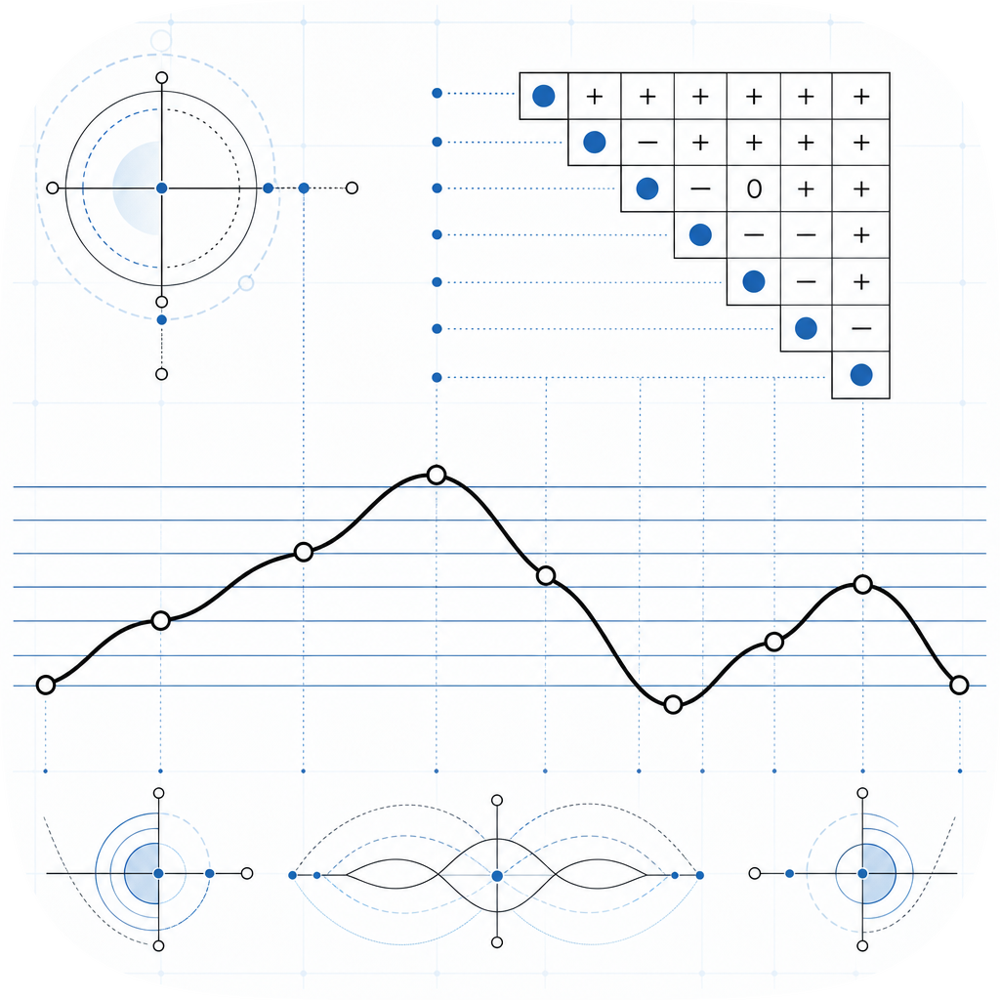

# melodic-contour

<p align="center">
  
</p>

Melodic contour theory in TypeScript. Implements the core formalisms from Morris (1987), Friedmann (1985), and Marvin and Laprade (1987).

**npm release is pending** (requires manual 2FA OTP). Install from GitHub for now.

## What is contour theory?

Melodic contour describes the shape of a melody - its pattern of ups and downs - independent of specific intervals. A contour segment (CSeg) represents this shape as a sequence of ranked positions: the lowest note becomes 0, the next higher note 1, and so on.

## Install

```bash
npm install melodic-contour
```

## API

### `cseg(pitches: number[]): number[]`
Maps a pitch list to contour integers by rank. Throws if pitches repeat.

### `validateCseg(c: number[]): void`
Validates a CSeg (distinct integers 0..n-1). Throws if invalid.

### `comMatrix(c: number[]): number[][]`
Comparison Matrix. COM[i][j] = sign(c[j] - c[i]) in {-1, 0, +1}.

### `cas(c: number[]): number[]`
Contour Adjacency Series. Signs of successive differences.

### `casVector(c: number[]): [number, number]`
[ascents, descents] from the CAS.

### `csim(a: number[], b: number[]): number`
Contour Similarity. Fraction of matching entries above the COM matrix diagonal. Range [0, 1].

### `cint(c: number[]): number[][]`
Contour Interval Matrix. Upper triangle: CINT[i][j] = c[j] - c[i] for j > i.

### `retrograde(c: number[]): number[]`
Reverses a CSeg.

### `inversion(c: number[]): number[]`
Inverts a CSeg: maps each x to (n-1) - x.

### `retrogradeInversion(c: number[]): number[]`
Reversal of the inversion.

### `equivalenceClass(c: number[]): number[][]`
Returns unique forms among {Prime, Retrograde, Inversion, RetrogradeInversion}.

## Usage

```typescript
import { cseg, comMatrix, cas, casVector, csim, equivalenceClass } from "melodic-contour";

const c = cseg([60, 67, 62, 64]); // [0, 3, 1, 2]
const com = comMatrix(c);
const series = cas(c);            // [1, -1, 1]
const [asc, desc] = casVector(c); // [2, 1]
const sim = csim(c, c);           // 1
const forms = equivalenceClass(c); // [[0,3,1,2],[2,1,3,0],[3,0,2,1],[1,2,0,3]]
```

## References

- Morris, R. D. (1987). *Composition with Pitch-Classes*. Yale University Press.
- Friedmann, M. L. (1985). A methodology for the discussion of contour: Its application to Schoenberg's music. *Journal of Music Theory*, 29(2), 223-248.
- Marvin, E. W., and Laprade, P. A. (1987). Relating musical contours: Extensions of a theory for contour. *Journal of Music Theory*, 31(2), 225-267.
